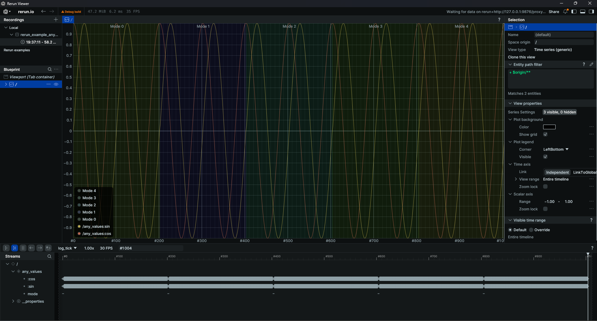
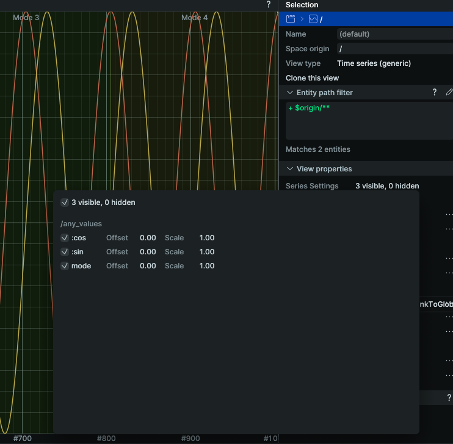

# Generic Timeseries View

This repository provides an in-depth example of a custom Rerun viewer which supports plotting scalar data from dynamic archetypes. Any entity which has components of ComponentType `rerun.components.Scalar` or `rerun.components.Text` can be viewed on the GenericTimeSeries.

# Example usage

Python code for logging a [dynamic archetype](https://rerun.io/docs/howto/logging/custom-data):

```py

"""Log arbitrary data."""

import rerun as rr
import math

rr.init("rerun_example_any_values", spawn=True)

for sample in range(1000):
    rr.log(
        "any_values",
        rr.AnyValues()
            .with_component_override("sin", rr.components.ScalarBatch._COMPONENT_TYPE, [math.sin(sample * .0628)])
            .with_component_override("cos", rr.components.ScalarBatch._COMPONENT_TYPE, [math.cos(sample * .0628)])
    )

    if sample % 200 == 0:
        rr.log(
            "any_values",
            rr.AnyValues()
                .with_component_override(":mode", rr.components.TextBatch._COMPONENT_TYPE, f"Mode {sample // 200}")
        )

```



The series settings allow you to enable / disable certain components, as well as set a scale and offset.



# Under the hood

Rerun uses an Entity Component System with _tagged components_, where each component has three pieces of data associated with it. Currently, the support for user-defined archetypes is pretty limited. You can make an entity with your own components, but the only default viewer that works for these custom components is the Dataframe viewer. In particular, the TimeSeries view can only visualize one component per entity, and that component must have the component identifier `Scalars:scalars`. 

However, Rerun recently added [tagged components](https://github.com/rerun-io/rerun/issues/6889), which associate some optional extra data with each component. Now you can have components with unique or user-defined identifiers (not just `Scalars:scalars`) that all share the same type, like `rerun.components.Scalar`.

# Why would you want this?

I developed this to use with [Ardupilot log messages](https://ardupilot.org/copter/docs/logmessages.html). Each log message has multiple associated data points for a single moment in time. Logging each data stream as its own entity would result in an unacceptable amount of memory overhead (up to 20-30x, and many of these logs stretch to hundreds of megabytes or even multiple gigabytes in size).
